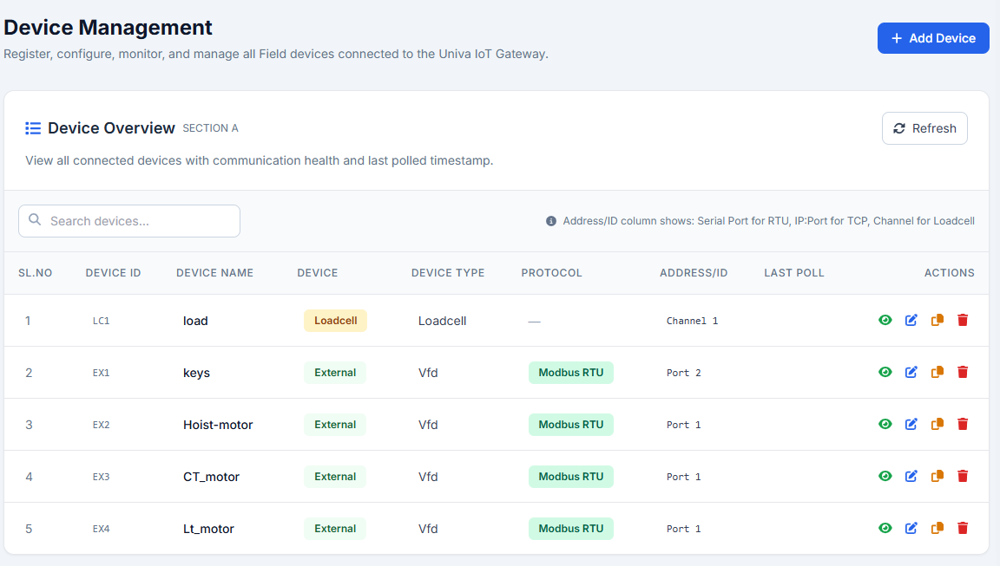
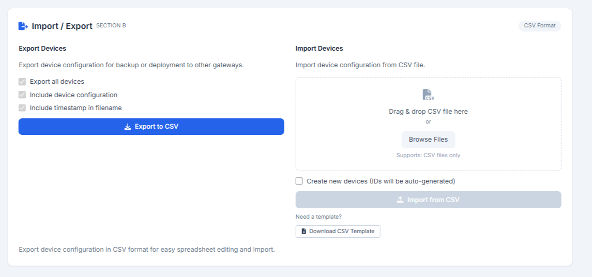
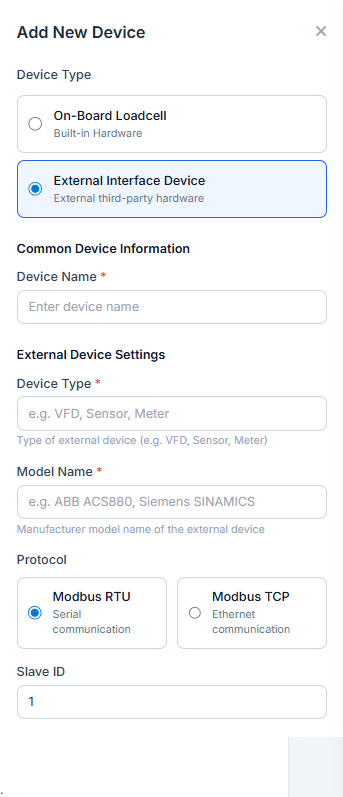
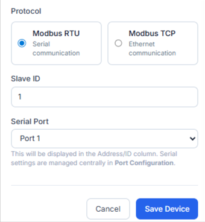
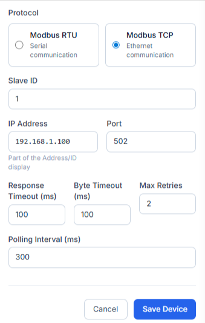

..
   Command to build Sphinx documentation:
   cd doc && .\make.bat html

4. Device Management
====================

The **Device Management** module registers and manages all physical and virtual telemetry sources connected to the gateway. Users can add devices via a slide-in form, monitor communication, and export configuration profiles.

4.1 Device Overview Table
-------------------------
The dashboard displays a table tracking all active devices:
- **Index Columns**: Sl.No, Device ID, Device Name, Device Type, and Protocol.
- **Address/ID**: Displays the connection path (Serial Port for RTU, IP:Port for TCP, or Channel Path for internal loadcells).
- **Last Poll**: Live timestamp indicating the last successful data collection.
- **Actions Panel**:

  * *View Details*: Expands an inline card detailing communication stats.
  * *Edit*: Opens the configuration drawer to adjust names, capacity, or connection settings.
  * *Delete*: Removes the device and its mapped registers.

4.2 Import & Export Operations (CSV)
------------------------------------
Configuring multiple gateways is simplified using CSV import and export:
- **Exporting**: Generates a CSV file containing all registered device names, protocols, and connection parameters.
- **Importing**: Drag-and-drop file upload. An option checkbox allows users to "Create new devices (IDs will be auto-generated)" which appends configurations without overwriting existing device keys.
- **Template Download**: Provides a sample CSV template mapping all required headers.

4.3 Adding a New Device
-----------------------
Clicking **Add Device** slides a panel from the right. Users first select the hardware type and configure its inputs.

**Common Device Information**:
- **Device Type**: Choice between **On-Board Loadcell** (built-in analog hardware) and **External Interface Device** (third-party hardware).
- **Device Name**: A custom text identifier (e.g., ``Main Hoist Loadcell`` or ``VFD Hoist Motor``). Required.

4.3.1 On-Board Loadcell (Internal Type)
^^^^^^^^^^^^^^^^^^^^^^^^^^^^^^^^^^^^^^^
This registers the gateway's direct, built-in analog-to-digital converter channels.
- **Quantity Limits**: The gateway supports a maximum of two loadcell channels.
- **Mode Selection**:

  * **Single Point**: Maps a single loadcell to a selected channel.
  * **Differential**: Uses **Channel 1** as a fixed differential input. This utilizes both internal lines, thereby locking out Channel 2.

- **Channel**: Selects the hardware interface path. Required for Single Point mode:

  * *Channel 1*: ``/sys/bus/iio/devices/iio:device0/in_voltage0_raw``
  * *Channel 2*: ``/sys/bus/iio/devices/iio:device1/in_voltage0_raw``

- **Poll Interval (ms)**: The frequency of raw value polling (range: ``1`` to ``1000`` ms, default: ``10`` ms).
- **Protected ADC Parameters**: For hardware integrity, these specifications are read-only and cannot be edited by the user:

  * *Resolution Bits*: Fixed at ``24`` bits.
  * *Effective Bits*: Fixed at ``14`` bits.
  * *Signed / Unsigned*: Fixed to ``Unsigned``.
  * *Gain*: Fixed at ``1``.
  * *Vref (V)*: Fixed at ``5`` V.
  * *Raw Min*: Fixed at ``0``.
  * *Raw Max*: Fixed at ``16383``.

- **Capacity Specification**:

  * *Min*: Minimum expected load measurement (default: ``0``).
  * *Max*: Maximum expected loading capacity (default: ``1000``).
  * *Unit*: Unit of load measurement (options: ``kg`` or ``ton``).
  * *Deadband*: Weight variation threshold below which fluctuations are ignored to prevent noise/jitter.
  * *Overload*: Value above which overload warnings are triggered.
  * *Note*: Mapped tag references (``load`` and ``status``) are automatically generated.

.. list-table::
   :widths: 50 50
   :header-rows: 0
   :align: center

   * - .. image:: _static/IMAGES/device-management/device-add-loadcell-1.png
          :align: center
          :width: 100%
     - .. image:: _static/IMAGES/device-management/device-add-loadcell-2.png
          :align: center
          :width: 100%

4.3.2 External Interface Device (External Type)
^^^^^^^^^^^^^^^^^^^^^^^^^^^^^^^^^^^^^^^^^^^^^^^
Allows integrating third-party components (e.g., Variable Frequency Drives (VFDs), sensors, power meters).

Common Settings
"""""""""""""""
- **Device Type**: Free text specifying the hardware category (e.g. ``VFD``, ``Sensor``, ``Meter``). Required.
- **Model Name**: Free text indicating the manufacturer model (e.g. ``ABB ACS880``, ``Siemens SINAMICS``). Required.
- **Protocol**: Radio choice between **Modbus RTU** (Serial) and **Modbus TCP** (Ethernet).

Modbus RTU Settings
"""""""""""""""""""
- **Slave ID**: Modbus unit identifier (range: ``1`` to ``247``, default: ``1``).
- **Serial Port**: Selects the hardware port (options: **Port 1** (``/dev/ttymxc5``) or **Port 2** (``/dev/ttymxc2``)). Note that central settings are configured in :doc:`port-configuration`.

Modbus TCP Settings
"""""""""""""""""""
- **Slave ID**: Modbus unit identifier (range: ``1`` to ``247``, default: ``1``).
- **IP Address**: IPv4 address of the target Modbus TCP server (default: ``192.168.1.100``).
- **Port**: TCP connection port (range: ``1`` to ``65535``, default: ``502``).
- **Response Timeout (ms)**: Network response wait threshold (range: ``10`` to ``10000`` ms, default: ``100`` ms).
- **Byte Timeout (ms)**: Wait threshold between consecutive packet bytes (range: ``10`` to ``10000`` ms, default: ``100`` ms).
- **Max Retries**: Number of connection retry attempts (range: ``0`` to ``10``, default: ``2``).
- **Polling Interval (ms)**: Polling speed for registers (range: ``10`` to ``10000`` ms, default: ``300`` ms).

