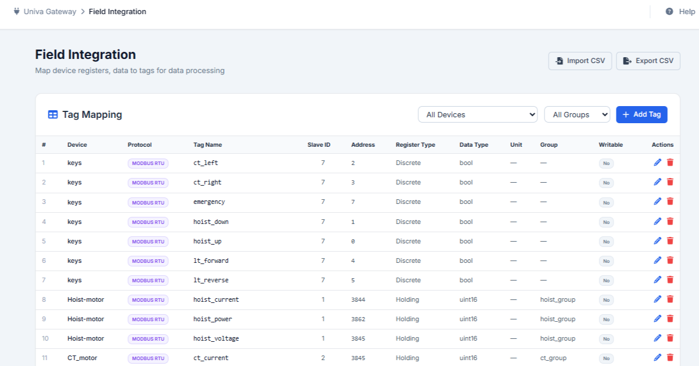
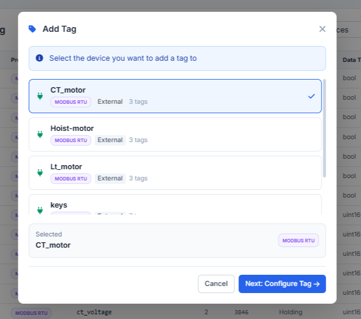
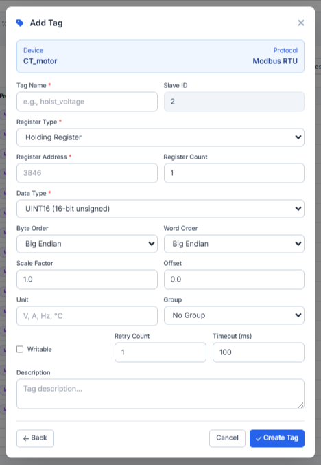
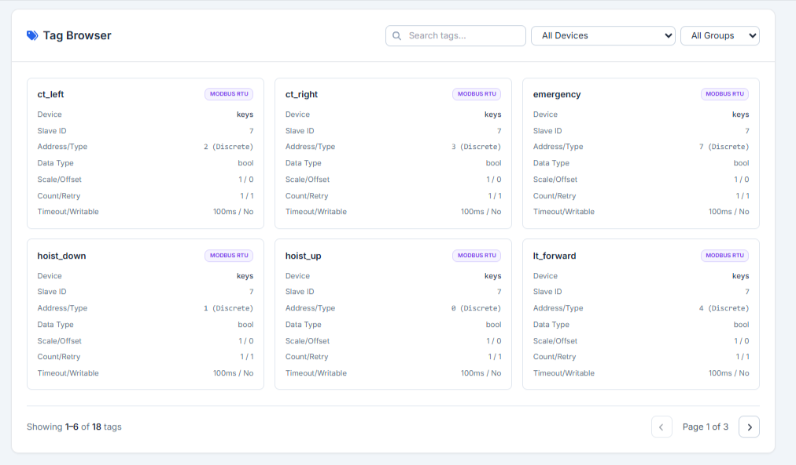
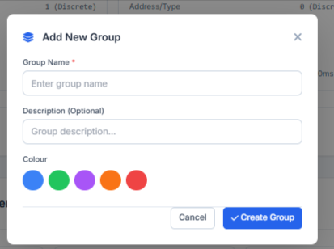
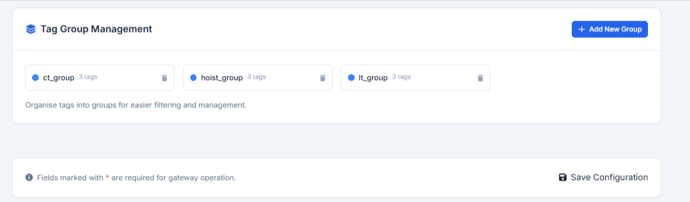

..
   Command to build Sphinx documentation:
   cd doc && .\make.bat html

6. Field Integration (Tag Mapping)
==================================

The **Field Integration** module maps physical device registers and digital channels to logical tags. Mapped tags can then be used for local calculation engines, safety logic, or cloud streaming.

6.1 Tag Mapping Table
---------------------
The primary dashboard lists all created tags:
- **Columns**: Index, Device, Protocol, Tag Name, Slave ID, Register Address, Register Type, Data Type, Unit, Group, Writable, Actions.
- **Filters**: Quickly filter the tag database by **Device** or **Tag Group**.

6.2 Adding a Tag
----------------
Clicking **Add Tag** opens a modal wizard to configure and register a physical tag.

Step 1: Device Selection
^^^^^^^^^^^^^^^^^^^^^^^^
Select the target registered device from the list. The modal displays:
- **Device Name**: Custom label of the selected device.
- **Protocol**: Protocol type (e.g. Modbus RTU, Modbus TCP, Load Cell).
- *Action*: Click **Next: Configure Tag** to proceed to the form.

Step 2: Parameter Configuration
^^^^^^^^^^^^^^^^^^^^^^^^^^^^^^^
Fill out the configuration settings for the selected device type.

**Modbus Parameter Configuration**
For Modbus RTU or TCP devices, fill out the following inputs in the form:
- **TagName**: Unique alphanumeric string key to identify the register (e.g. ``hoist_voltage``). Required.
- **Slave ID**: Auto-populated based on the selected device setting (view-only).
- **Register Type**: Dropdown menu selecting the target Modbus register map type:

  * *Holding Register*: Read/Write 16-bit analog registers.
  * *Input Register*: Read-only 16-bit analog registers.
  * *Coil*: Read/Write 1-bit digital outputs.
  * *Discrete Input*: Read-only 1-bit digital inputs.

- **Register Address**: Start offset address of the register (range: ``0`` to ``65535``). Required.
- **Register Count**: Total consecutive registers to query (range: ``1`` to ``10``, default: ``1``).
- **Data Type**: Memory format translation selection:

  * *INT16 (16-bit signed)*
  * *UINT16 (16-bit unsigned)* (default)
  * *INT32 (32-bit signed)*
  * *UINT32 (32-bit unsigned)*
  * *FLOAT32 (32-bit float)*
  * *BOOL (boolean)*

- **Byte Order**: Alignment order for multi-byte formats (options: **Big Endian** or **Little Endian**).
- **Word Order**: Alignment order for multi-word data structures (options: **Big Endian** or **Little Endian**).
- **Scale Factor**: Multiplier coefficient applied to translate raw register integers (default: ``1.0``).
- **Offset**: Translation constant offset value added to the scaled value (default: ``0.0``).
- **Unit**: String unit symbol appended to the output values (e.g., ``V``, ``A``, ``Hz``, ``°C``).
- **Group**: Select dropdown to assign this tag to a custom Tag Group (options: ``No Group`` or any created group).
- **Writable**: Checkbox enabling control output commands to write back to this register.
- **Retry Count**: Individual query attempt retries upon communication timeouts (range: ``0`` to ``10``, default: ``1``).
- **Timeout (ms)**: Wait threshold response duration for individual tag poll (range: ``10`` to ``10000`` ms, default: ``100`` ms).
- **Description**: Textarea detail notes clarifying the purpose or context of the tag.

**Loadcell Auto-Tags**
For On-Board Loadcells, tags are automatically defined. Clicking Next displays a read-only confirmation screen showing the two standard exposed tags:
1. ``load``: FLOAT32 value in the configured unit (kg or ton).
2. ``status``: UINT16 hardware status code.

6.3 Tag Browser
---------------
Below the mapping table, the **Tag Browser** provides a card-based visualization of live values.
- Search tags by keyword.
- Filter cards by Device and Group.
- Each card shows live indicators of tag properties (Data Type, scaling, write capability, and group).

6.4 Tag Group Management
------------------------
To structure large registries, administrators can create Tag Groups.

Creating a Tag Group
^^^^^^^^^^^^^^^^^^^^
Administrators can create groups via the Add Group modal form:
- **Group Details**: Group Name and Description.
- **Color Indicators**: Assign a distinctive color (Blue, Green, Purple, Orange, Red) to display as a badge on the tag mapping list.

Group Organization
^^^^^^^^^^^^^^^^^^
The main group panel lists all configured groups along with their assigned colors, description, and the number of mapped tags in each group.

6.5 CSV Mappings Import & Export
--------------------------------
- **Export CSV**: Export the mapping table to a CSV file.
- **Import CSV**: Bulk load mappings from a CSV file.
- **Auto-Create Groups Alert**: If the imported CSV contains references to tag groups that do not exist on the gateway, a specialized modal prompt (*"Auto-Create Groups?"*) lists the missing groups and offers to automatically create them with default colors to ensure configuration integrity.
