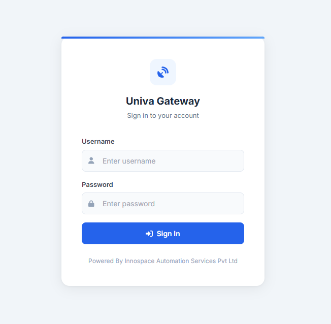
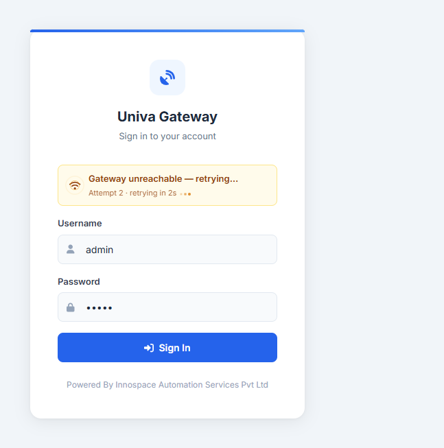

.. Build Command:
..     cd doc && .\make.bat simplepdf

1. First Login, Loading & Retry
===============================

The Univa Gateway initial landing interface allows administrators and authorized operators to authenticate and access the system configuration utilities.

1.1 Credentials Interface
-------------------------
The gateway sign-in interface includes the following elements:

- **Logo Branding**: Powered by *Innospace Automation Services Pvt Ltd*.
- **Username**: Text input field.
- **Password**: Password input field.
- **Sign In Button**: Submits the authentication credentials.

1.2 Loading and Authentication Status
-------------------------------------
Upon submitting the credentials form:

- **Status Check**: The page checks authentication status with the backend. If already authenticated, the client is immediately redirected to the dashboard.
- **Loading Indicator**: When a login is in progress, the "Sign In" button changes state to **loading**. It is disabled to prevent duplicate submissions, and displays a spinning wheel animation while the client waits for the server response.

1.3 Connection Failures & Exponential Back-Off Retry
----------------------------------------------------
If the gateway is unreachable due to a network timeout or offline server:

- **Network Alert**: A prominent network status banner is displayed at the top of the card showing:

  * *"Gateway unreachable — retrying..."*
  * *"Attempt [Count] · retrying in [X]s"*

- **WiFi Pulse Animation**: The warning includes a dynamic WiFi pulse signal icon indicating that the browser is actively attempting reconnection.
- **Exponential Back-Off**: To avoid overloading the gateway, the client schedules automatic retries using an exponential back-off strategy starting at 3 seconds, scaling as follows:

  * **Attempt 1**: 3 seconds delay
  * **Attempt 2**: 5 seconds delay
  * **Attempt 3**: 9 seconds delay
  * Subsequent attempts increment up to a maximum delay threshold of 30 seconds.

1.4 Live Online Auto-Reconnection
---------------------------------
In addition to the automatic timer retries, the login form binds to browser ``online`` events. If the user's browser restores network connection during a retry sequence:

- The active retry delay timer is immediately cancelled.
- The interface displays a *"Network restored — connecting..."* alert.
- The login request is retried immediately (with a brief 500ms safety buffer) without waiting for the remaining countdown seconds.

1.5 Session Expiration Handling
-------------------------------
When an active user's session expires, the gateway redirects them back to the login page with an expired session indicator.

- **Session Expired Alert**: The client displays a specialized yellow warning banner stating: *"Your session has expired. Please sign in again."*
- This alert is automatically cleared once the user starts typing inside the username or password inputs.
