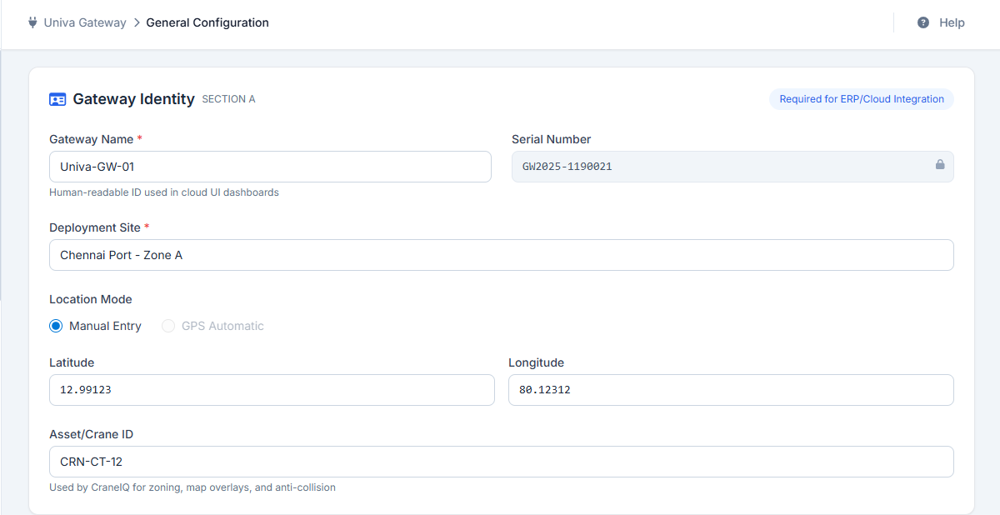
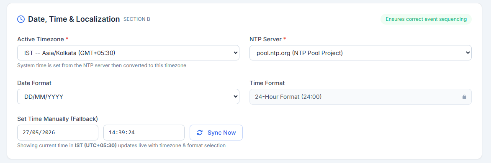
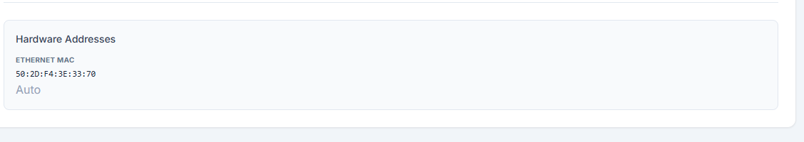
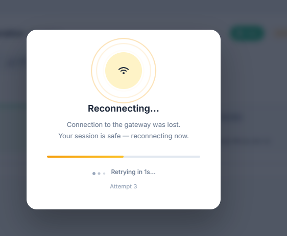
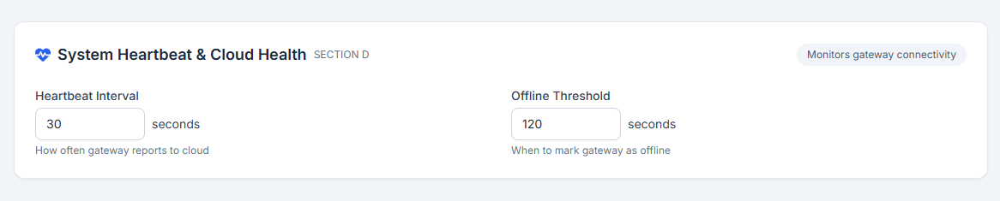
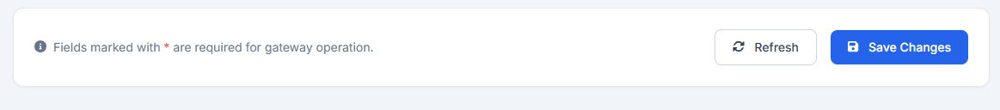

.. Build Command:
..     cd doc && .\make.bat simplepdf

3. General Configuration
=========================

The **General Configuration** page establishes the Univa IoT Gateway's identity, network paths, time parameters, and heartbeat frequencies. These settings are required before activating any devices or pushing data to the cloud.

3.1 Gateway Identity (Section A)
--------------------------------
Provides details on identifying and locating the device:

- **Gateway Name**: A human-readable identifier utilized in cloud UI dashboards.
- **Serial Number**: A unique, read-only hardware identifier (e.g., ``GW2025-1190021``) locked for security.
- **Deployment Site**: Descriptive name of where the gateway is physically deployed (e.g., ``Chennai Port - Zone A``).
- **Location Mode**: Supports two coordinate options:

  * *Manual Entry*: Allows administrators to manually enter coordinates.
  * *GPS Automatic*: Disabled by default on current hardware configurations because the device lacks GPS antennas.

- **Latitude & Longitude**: High-precision decimal degrees.
- **Asset/Crane ID**: String identifier linking the gateway to a specific crane (e.g., ``CRN-CT-12``). This identifier is vital for CraneIQ zoning and collision warnings.

3.2 Date, Time & Localization (Section B)
-----------------------------------------
Maintains accurate localization to ensure event timestamps match actual sequences:

- **Active Timezone**: Dropdown selection of active timezone (e.g., Asia/Kolkata IST, UTC, Europe/London GMT, Asia/Shanghai CST, Asia/Tokyo JST).
- **NTP Server**: Primary Network Time Protocol target (e.g., ``time.google.com`` or ``pool.ntp.org``) for automatic time correction.
- **Date Format**: Choose layout format (DD/MM/YYYY, MM/DD/YYYY, or YYYY-MM-DD).
- **Time Format**: System default is locked to a 24-hour format (HH:MM).
- **Manual Time Sync**: Fallback control enabling manual date (DD/MM/YYYY) and time (HH:MM) entries, with a **Sync Now** button.

3.3 Network Configuration (Section C)
-------------------------------------
Defines network channels for outbound data delivery and local configuration interface.

**Network Modes**
Users can switch between three modes via the segmented tab interface:

1. **Ethernet**: Wired connection. Displays status cards for dual ports (``eth0`` and ``eth1``) showing:

   * Interface State (Connected / Disconnected)
   * IP Address
   * Hardware MAC Address
   * Selectable active interface radio button.

2. **WiFi**: Wireless client.

   * *Status Indicator*: Live details showing Connection State, connected SSID, signal strength in decibels (dBm), IP Address, MAC Address, BSSID, and Frequency.
   * *Select Network*: Clicking the scan button queries surrounding wireless channels and lists detected SSIDs.
   * *Credentials*: Password input field with an eye toggle to inspect hidden text.

3. **LTE / 4G Cellular**: Mobile broadband.

   * *GSM Modem Status*: Displays power status. Alerts the user if no GSM/LTE modem is detected.
   * *Signal Status*: Graph bar and percentage representing signal reception quality.
   * *SIM & Carrier Data*: Identifies active mobile operator, technology (2G/3G/4G/5G), IMEI, ICCID, IMSI, and Assigned IP.
   * *APN Credentials*: Configuration fields for APN Name (e.g., ``airtelgprs.com``), Username, and Password.

**Auto-Connect**
An Auto-Connect toggle switch determines the gateway's automatic connection behavior:

- **Auto-Connect ON**: The gateway automatically selects and connects to the best available connection among the configured interfaces based on pre-defined network priority.

  .. image:: _static/IMAGES/general/general-net-auto.png
     :align: center
     :width: 80%

- **Auto-Connect OFF**: The gateway remains locked to the active interface tab you are currently viewing. For example, if you switch to the WiFi tab with Auto-Connect disabled, the gateway will exclusively use or attempt to use the WiFi interface, even if there is no active WiFi connection.

  .. image:: _static/IMAGES/general/general-net-auto-off.png
     :align: center
     :width: 80%

  Similarly, if Auto-Connect is disabled while you are using the LTE cellular network, the gateway will stay on LTE. If you need to switch to WiFi in this state, you must manually navigate to the WiFi tab interface and click the **Connect** button.

  .. image:: _static/IMAGES/general/general-net-manual-connect.png
     :align: center
     :width: 80%

**Hardware Addresses**
A summary panel lists active hardware addresses for all physical interfaces (Ethernet MAC, WiFi MAC, and LTE IMEI) for diagnostic validation.

**Network Switching & Reconnection**
When switching between network modes or applying new settings, a full-screen reconnecting modal overlays the UI. This modal displays a spinner and remains active until the gateway successfully connects to the selected interface.

3.4 Heartbeat & Cloud Health (Section D)
----------------------------------------
Configures how the gateway reports diagnostic telemetry:

- **Heartbeat Interval**: Frequency in seconds (10 to 3600, default 30) at which the gateway reports online status to the cloud.
- **Offline Threshold**: Buffer time in seconds (30 to 3600, default 120) after which the cloud interface flags the gateway as offline if no telemetry is received.

3.5 Operations & Interface
--------------------------
- **Refresh**: Reloads all telemetry and identity parameters from the gateway database.
- **Save Changes**: Submits the configuration inputs to the API. During saving, a full-page blur loader freezes inputs and indicates that the settings are being applied.
- **Toasts**: Notifies the operator of successful operations or input errors.

