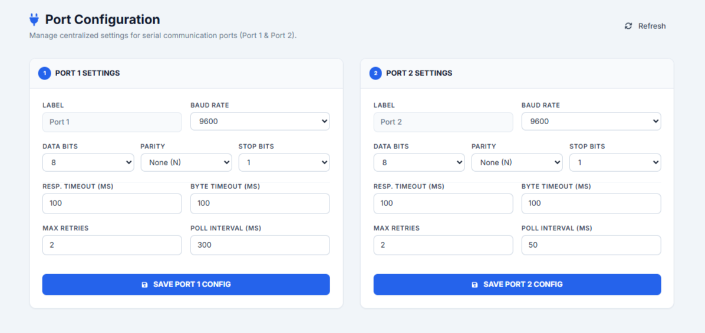
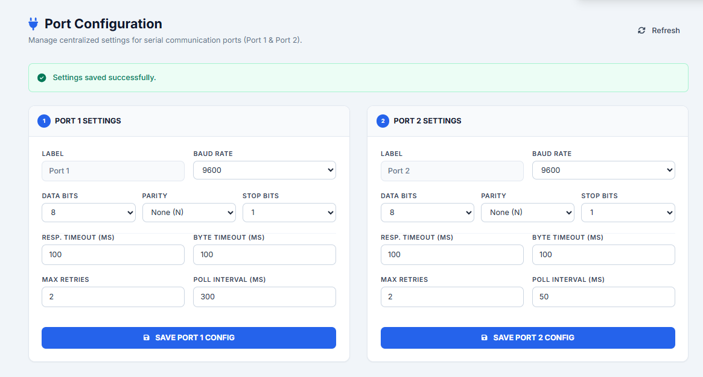

..
   Command to build Sphinx documentation:
   cd doc && .\make.bat html

5. Port Configuration
======================

The **Port Configuration** module centralizes all serial communication parameters for physical RS-485/RS-232 serial interfaces on the gateway. Modbus RTU external devices configured in :doc:`device-management` reference these ports, ensuring configurations are maintained in one location rather than entered for each device.

5.1 Serial Ports
----------------
The gateway exposes two independent physical serial channels:
- **PORT 1 SETTINGS**: Controls interface port 1.
- **PORT 2 SETTINGS**: Controls interface port 2.

5.2 Communication Parameters
----------------------------
For both Port 1 and Port 2, users can configure the following options:
- **Label**: Read-only display identifying the port.
- **Baud Rate**: Transmission speed. Supports standard rates: 1200, 2400, 4800, 9600, 19200, 38400, 57600, and 115200.
- **Data Bits**: Number of data bits per packet (5, 6, 7, or 8 bits).
- **Parity**: Error checking byte. Selection includes:

  * *None (N)*
  * *Even (E)*
  * *Odd (O)*

- **Stop Bits**: Transmission termination bits (1 or 2 bits).

5.3 Timing & Polling
--------------------
- **Response Timeout**: Duration in milliseconds (10 to 5000 ms) the gateway waits for a response from serial slave devices before registering a timeout error.
- **Byte Timeout**: Maximum silent time in milliseconds (1 to 1000 ms) allowed between consecutive bytes in a single packet.
- **Max Retries**: The number of attempts (0 to 10) to re-transmit a packet after a timeout or CRC error before flagging a device failure.
- **Poll Interval**: Frequency in milliseconds (50 to 10000 ms) at which the serial driver queries serial devices connected to this port.

5.4 Port Save Actions
---------------------
- **Refresh**: Pulls the active serial configuration from the gateway daemon.
- **Save Port Config**: Saves and restarts the serial listener for that specific port. Successful updates trigger a green confirmation alert banner (*"Settings saved successfully"*).

