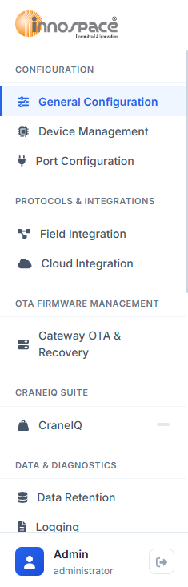

.. Build Command:
..     cd doc && .\make.bat simplepdf

2. Gateway Navigation (Sidebar)
===============================

The sidebar on the left side of the EDGE UI provides unified navigation across all gateway configuration, monitoring, and utility modules.

**Sidebar Sections & Feature Availability**
The features in the sidebar are organized into logical sections. The availability of each module in the current release is detailed below:

* **Configuration**:

  * **General Configuration**: *[In this release]* Establishes gateway identity, timezones, network modes, and heartbeat parameters.
  * **Device Management**: *[In this release]* Registers local/external devices (e.g. analog loadcells and Modbus RTU/TCP units).
  * **Port Configuration**: *[In this release]* Configures communication settings for serial RS-485/RS-232 ports.

* **Protocols & Integrations**:

  * **Field Integration**: *[In this release]* Maps physical device registers to logical tag names.
  * **Cloud Integration**: *[In this release]* Mappings outbound telemetry data to MQTT, HTTP, or FTP/SFTP formats.

* **OTA Firmware Management**:

  * **Gateway OTA & Recovery**: *[In this release]* Performs over-the-air firmware upgrades and system recovery backups.

* **CraneIQ Suite**:

  * **CraneIQ**: *[In this release]* Calibrates loadcell parameters and manages signal filters. Additional crane intelligence features (crane profiles, anti-collision safety zones) are scheduled for the next release (r002).

* **Data & Diagnostics** *[Not in this release]*:

  * *Data Retention*: Local storage buffer management.
  * *Logging*: Active debugging logs.
  * *Diagnostics & Live Terminal*: Low-level shell interface for troubleshooting.

* **Security & Access** *[Not in this release]*:

  * *Security & Access Control*: Active directory and role-based permissions.
  * *Licensing & Subscriptions*: Device registration and software license validation.

* **Automation** *[Not in this release]*:

  * *Scheduler / Automation Jobs*: Timer-based task rules.
  * *Alerts & Event Classes*: Severity thresholds and message queues.
  * *Rule Engine*: Custom boolean/if-then safety logic.

* **System** *[Not in this release]*:

  * *Backup & Restore*: Settings exports.
  * *Notification*: SMTP/Webhook dispatch targets.

**User Profile & Session Control**
Located at the very bottom (footer) of the sidebar:

- **User Profile**: Displays the currently logged-in user's name and their assigned system role (e.g., *administrator* or *system user*).
- **Logout Button**: Clicking the red exit icon terminates the active session, clears all authorization cookies, and redirects the browser back to the login page.
