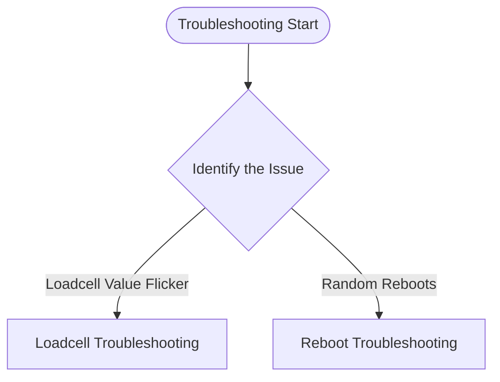

# Univa IoT Gateway - Troubleshooting Guide

Use the flowchart below to navigate to the correct troubleshooting logs:

## Available Logs
- [Loadcell Troubleshooting](loadcell.md)
- [Reboot Troubleshooting](reboot.md)
